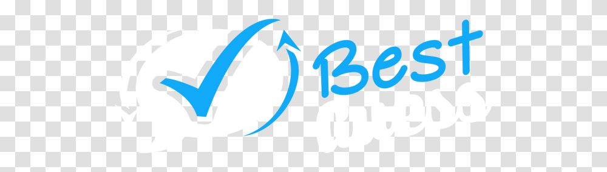

[![Contributors][contributors-shield]][contributors-url]
[![Forks][forks-shield]][forks-url]
[![Stargazers][stars-shield]][stars-url]
[![Issues][issues-shield]][issues-url]
[![LinkedIn][linkedin-shield]][linkedin-url]

<!-- PROJECT LOGO -->
 

  

<h3 align="center">Guess The Number Board!</h3>

  

    Project for General Assembly Web Development Immersive
     
    <a href="https://github.com/PrinceJonaa/Guess-The-Number-Board"><strong>Documentation »</strong></a>
     
     
    <a href="https://princejonaa.github.io/Guess-The-Number-Board/">View Demo</a>
    ·
    <a href="https://github.com/PrinceJonaa/Guess-The-Number-Board/issues">Report Bug</a>
    ·
    <a href="https://github.com/PrinceJonaa/Guess-The-Number-Board/issues">Request Feature</a>
  

<!-- TABLE OF CONTENTS -->

  
Table of Contents

  <ol>
    <li>
      <a href="#about-the-project">About The Project</a>
      <ul>
        <li><a href="#Language-Used">Languages Used</a></li>
      </ul>
    </li>
    <li>
      <a href="#Projects">Motivation</a>
      <ul>
        <li><a href="#prerequisites">Prerequisites</a></li>
      </ul>
    </li>
    <li><a href="#roadmap">Roadmap</a></li>
    <li><a href="#contributing">Contributing</a></li>
    <li><a href="#license">License</a></li>
    <li><a href="#contact">Contact</a></li>
    <li><a href="#acknowledgments">Acknowledgments</a></li>
  </ol>

<!-- ABOUT THE PROJECT -->
## About The Project

This is my unit one project for the semester. I am using the using all of my previous knowledge of my class to create a game that will allow two  users to guess a number between 1 & 20. The first one to move around the board wins

(<a href="#top">back to top</a>)

### Language Used

* [Bootstrap](https://getbootstrap.com)
* [CSS](https://www.w3.org/TR/CSS/#css)
* [HTML](https://html.spec.whatwg.org)
* [JavaScript](https://www.ecma-international.org/publications-and-standards/standards/ecma-262/)

(<a href="#top">back to top</a>)

<!-- Movivation -->
## Motivation

I wanted a quick game that I could make for my class. I wanted to make a game that is fast-paced yet challenging enough to promote something fun to do with others.

### Prerequisites

None! Just run the demo or clone the repository  and start playing!

(<a href="#top">back to top</a>)

<!-- ROADMAP -->
## Roadmap

* [x] MVP
* Adding more events!
* Adding more questions!

See the [open issues](https://github.com/PrinceJonaa/Guess-The-Number-Board/issues) for a full list of proposed features (and known issues).

(<a href="#top">back to top</a>)

<!-- CONTACT -->
## Contact

Jonathan - [@PrinceJonaa](https://twitter.com/PrinceJonaa)

Project Link: [https://github.com/PrinceJonaa/Guess-The-Number-Board](https://github.com/PrinceJonaa/Guess-The-Number-Board)

(<a href="#top">back to top</a>)

<!-- ACKNOWLEDGMENTS -->
## Acknowledgments

* To be announced

(<a href="#top">back to top</a>)

<!-- MARKDOWN LINKS & IMAGES -->
<!-- https://www.markdownguide.org/basic-syntax/#reference-style-links -->
[contributors-shield]: https://img.shields.io/github/contributors/princejonaa/Beginner-Projects.svg?style=for-the-badge
[contributors-url]: https://github.com/PrinceJonaa/Guess-The-Number-Board/graphs/contributors
[forks-shield]: https://img.shields.io/github/forks/princejonaa/Beginner-Projects.svg?style=for-the-badge
[forks-url]: https://github.com/PrinceJonaa/Guess-The-Number-Board/network/members
[stars-shield]: https://img.shields.io/github/stars/princejonaa/Beginner-Projects.svg?style=for-the-badge
[stars-url]: https://github.com/PrinceJonaa/Guess-The-Number-Board/stargazers
[issues-shield]: https://img.shields.io/github/issues/princejonaa/Beginner-Projects.svg?style=for-the-badge
[issues-url]: https://github.com/PrinceJonaa/Guess-The-Number-Board/issues
[license-shield]: https://img.shields.io/github/license/princejonaa/Beginner-Projects.svg?style=for-the-badge
[license-url]: https://github.com/PrinceJonaa/Guess-The-Number-Board/blob/master/LICENSE.txt
[linkedin-shield]: https://img.shields.io/badge/-LinkedIn-black.svg?style=for-the-badge&logo=linkedin&colorB=555
[linkedin-url]: https://linkedin.com/in/jonathan-bonner-professional
[product-screenshot]: images/screenshot.png
